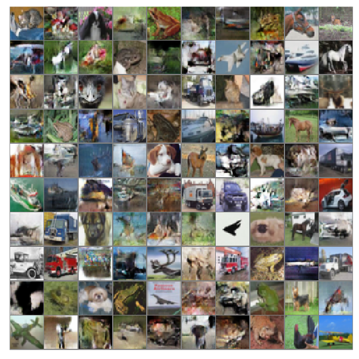

# JuliaGRAM: Julia implementation of GRAM-nets

This is the source code for the paper [Generative Ratio Matching Networks](https://openreview.net/forum?id=SJg7spEYDS).

## Check out the results interactively right now

You can check our experiment logs at https://app.wandb.ai/xukai92/gram-public, 
which are logged by [WeightsAndBiasLogger.jl](https://github.com/xukai92/WeightsAndBiasLogger.jl), 
a Julia interface for [Weights & Biases](https://www.wandb.ai/).

## How to run the code?

1. Install [Julia](https://julialang.org/downloads/) and make `julia` available in your executable path.
    - This code was developed using Julia 1.3.1 and we suggest using the same version.
2. Download the code in a location which we will refer as `GRAM_DIR`.
3. Start a Julia REPL by entering `julia` in your terminal.
    - Press `]` button to enter the package manager.
    - Install [DrWatson](https://github.com/JuliaDynamics/DrWatson.jl) and [PyCall](https://github.com/JuliaPy/PyCall.jl) by `add DrWatson PyCall`.
        - Input `using PyCall`.
        - Input `PyCall.Conda.add("matplotlib")` to install matplotlib.
        - Input `PyCall.Conda.add("tikzplotlib")` to install tikzplotlib.
        - Input `PyCall.Conda.add("wandb")` to install wandb (optional).
    - Activate the project environment by `activate $GRAM_DIR`.
    - Install all dependencies by `instantiate`.
    - Press `delete` or `backspace` to exit the package manager.
    - Exit the REPL.
4. Do `julia $GRAM_DIR/scripts/master.jl --exp 1`
    - This will produce Figure 1 (and Figure 6 & 9 in the appendix).
    - To produce other plots, change the argument to
        - `--exp 2` for Figure 2 (and Figure 7 in the appendix), or
        - `--exp 3` for Figure 8 in the appendix.
    - You can also adjust the parameter sweep in `master.jl` by yourself.
    - If you want to run multiple trainings in parallel, please append `JULIA_NUM_THREADS=$N_PARALLEL ` to the beginning of the command (with a space), where `N_PARALLEL` is the number of parallel trainings you want to run.
      - By default the script uses 2 GPUs for parallelism. You can add `--n_gpus $N_GPUS` to the command to control the number.

You can also modify the arguments in `scripts/gram.jl` and run the file on its own by `julia $GRAM_DIR/scripts/gram.jl`

Our code by default logs all the training details using [Weights & Biases](https://www.wandb.ai/), 
please install W&B and set it up following [here](https://docs.wandb.com/quickstart). 
Or if you don't want to log things, add `--nowandb`.

## Interact with the a pre-trained GRAM network on CIFAR10

We provide a pre-trained model using this Julia version of GRAM networks at `demo/cifar10-gramnet.bson`.
You can use the provided Jupyter notebook at `demo/interact.ipynb` to interact with our pre-trained GRAM network.

**NOTE**: This is NOT the exact code we used for the CIFAR10 experiment in our paper. 
For reproducibility of paper on those experiments, please check [GRAMFlow](https://github.com/GRAM-nets/GRAMFlow).

### A small quiz

We generated 50 images from our GRAM network and mixed them with 50 real images. Can you tell the generated ones from sampled ones?

Click [here](images/gram-answer.png) to see the answers. 
How many mistakes did you make?

---

| Maintainer |
| :-: |
| [Kai Xu](http://xuk.ai/) |
